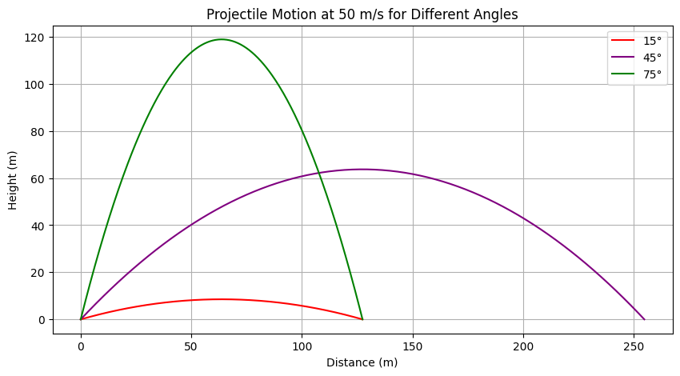

# Introduction

## Overview of Projectile Motion
Projectile motion is a fundamental concept in physics that describes the motion of an object thrown into the air, subject only to the force of gravity and, in some cases, air resistance. The trajectory of such an object follows a parabolic path, governed by the equations of kinematics. Understanding projectile motion is crucial in various scientific and engineering fields, as it provides insights into motion under constant acceleration.

## Motivation for Investigating the Range as a Function of the Angle of Projection
One of the most intriguing aspects of projectile motion is how the horizontal range depends on the angle of projection. By analyzing this relationship, we gain deeper insights into optimizing trajectories for maximum distance, which has practical applications in numerous disciplines. This investigation helps in understanding the interplay between initial velocity, gravitational acceleration, and launch height, all of which influence the range of a projectile.

Furthermore, by examining how the range varies with different angles, we can derive the optimal launch conditions for achieving maximum distance. This knowledge is particularly useful in sports, engineering, and aerospace applications.

## Real-World Applications
Understanding the dependence of range on the angle of projection has numerous real-world applications, including:

- **Sports**: Optimizing the angle for maximum range in activities such as soccer, basketball, javelin throw, and golf.
- **Engineering**: Designing efficient projectile-based systems such as water jets, ballistic missiles, and mechanical launchers.
- **Aerospace**: Calculating optimal launch angles for rockets and space probes to achieve desired trajectories with minimal energy expenditure.

By investigating the mathematical and computational aspects of projectile motion, we can develop better predictive models and enhance real-world applications where trajectory optimization is essential.

# Theoretical Foundation

## Governing Equations of Motion
Projectile motion can be analyzed by breaking it into horizontal and vertical components. These components are governed by kinematic equations under the influence of gravity.

### Horizontal Motion
Since there are no external forces acting in the horizontal direction (assuming air resistance is negligible), the horizontal velocity remains constant:

$$x = v_0 \cos(\theta) t$$

where:
- $x$ is the horizontal displacement,
- $v_0$ is the initial velocity,
- $\theta$ is the launch angle,
- $t$ is the time of flight.

### Vertical Motion
The vertical motion is influenced by gravity, following these equations:

$$y = v_0 \sin(\theta) t - \frac{1}{2} g t^2$$

$$v_y = v_0 \sin(\theta) - g t$$

where:
- $y$ is the vertical displacement,
- $v_y$ is the vertical velocity at time $t$,
- $g$ is the acceleration due to gravity.

## Deriving the Range Equation
The total time of flight $T$ can be found by setting $y = 0$ (when the projectile returns to its original launch height):

$$0 = v_0 \sin(\theta) T - \frac{1}{2} g T^2$$

Solving for $T$:

$$T = \frac{2 v_0 \sin(\theta)}{g}$$

Substituting this into the horizontal motion equation to find the range $R$:

$$R = v_0 \cos(\theta) T$$

$$R = v_0 \cos(\theta) \times \frac{2 v_0 \sin(\theta)}{g}$$

Using the trigonometric identity $2 \sin(\theta) \cos(\theta) = \sin(2\theta)$, we get:

$$R = \frac{v_0^2 \sin(2\theta)}{g}$$

## Effect of Varying Initial Conditions
Several factors influence the projectile’s range:

- **Initial velocity ($v_0$)**: Increasing $v_0$ increases the range quadratically, as $R \propto v_0^2$.
- **Launch angle ($\theta$)**: The range is maximized at $45^\circ$ for a given $v_0$ in an ideal case with no air resistance.
- **Gravitational acceleration ($g$)**: A higher $g$ reduces the range, which is why projectiles travel farther on planets with lower gravity.
- **Launch height**: If the projectile is launched from an elevated height, the time of flight increases, generally increasing the range.

This theoretical foundation forms the basis for further numerical simulations and real-world applications of projectile motion.

# Analysis of the Range

## Dependence of the Horizontal Range on the Projection Angle
The horizontal range of a projectile is a function of its initial velocity, launch angle, and gravitational acceleration. The range $R$ can be expressed as:

$$R = \frac{v_0^2 \sin(2\theta)}{g}$$

From this equation, we can observe that the range depends on the angle of projection $\theta$ in a sine function. Since $\sin(2\theta)$ varies between -1 and 1, the range will have a maximum value when $2\theta = 90^\circ$, i.e., $\theta = 45^\circ$.

### Optimal Angle for Maximum Range under Ideal Conditions
In the ideal case, with no air resistance and constant gravitational acceleration, the optimal angle for achieving the maximum range is $45^\circ$. This angle maximizes the value of $\sin(2\theta)$, which is equal to 1. Therefore, for a given initial velocity, the range $R$ will be:

$$R_{\text{max}} = \frac{v_0^2}{g}$$

Thus, under ideal conditions, launching a projectile at a $45^\circ$ angle yields the maximum horizontal range.

## Influence of Various Factors on the Range

### Initial Velocity ($v_0$)
The initial velocity directly influences the horizontal range, as seen from the equation:

$$R = \frac{v_0^2 \sin(2\theta)}{g}$$

The range is proportional to the square of the initial velocity ($v_0^2$). Therefore, increasing the initial velocity results in a quadratic increase in the range. This means that a small increase in the initial velocity can lead to a significant increase in the horizontal distance traveled by the projectile.

### Gravitational Acceleration ($g$)
The gravitational acceleration also plays a significant role in determining the range. As shown in the equation, the range is inversely proportional to $g$:

$$R = \frac{v_0^2 \sin(2\theta)}{g}$$

This means that a higher gravitational acceleration will reduce the range of the projectile. For example, projectiles on planets with stronger gravity (such as Earth) will have a shorter range compared to those on planets with weaker gravity (such as Mars). The range decreases as $g$ increases.

### Launch Height
The launch height of the projectile can also affect its range. When a projectile is launched from an elevated position, the time of flight increases, leading to a longer horizontal range. The range equation for a projectile launched from a height $h$ is more complicated, as it requires solving for the time of flight considering both the vertical and horizontal motions. However, in general:

- A greater launch height will increase the time of flight, allowing the projectile to travel farther horizontally.

## Non-Ideal Conditions

### Air Resistance
Air resistance is a real-world factor that can significantly alter the trajectory of a projectile. In the presence of air resistance, the horizontal and vertical motions are no longer independent, and the equations of motion become more complex. The range will no longer follow the simple parabolic path described by the ideal equations. Air resistance acts to reduce the horizontal velocity and can cause the projectile to fall short of its expected range.

The drag force due to air resistance is typically modeled as:

$$F_{\text{drag}} = \frac{1}{2} C_d \rho A v^2$$

where:
- $C_d$ is the drag coefficient,
- $\rho$ is the air density,
- $A$ is the cross-sectional area of the projectile,
- $v$ is the velocity of the projectile.

This force will decelerate the projectile, reducing the range and altering the optimal angle of projection.

### Varying Gravitational Fields
In some cases, the gravitational field may not be constant. For example, in the case of a projectile launched on a planet with varying gravity or on a very large scale such as in space, the gravitational acceleration $g$ may change with height or location. In such situations, the range equation must be modified to account for the changing gravitational field. A variable $g$ can make the optimal angle for maximum range change, as well as alter the general behavior of the projectile's trajectory.

In a non-uniform gravitational field, the gravitational acceleration at any point is given by:

$$g(r) = \frac{GM}{r^2}$$

where:
- $G$ is the gravitational constant,
- $M$ is the mass of the central body,
- $r$ is the distance from the center of the body.

This would require a more complex analysis involving the integration of the equations of motion to determine the range in such environments.

### Summary of Non-Ideal Effects
In non-ideal conditions, several factors can influence the range:

- **Air resistance**: Reduces the range by decelerating the projectile.
- **Varying gravitational fields**: Changes the gravitational acceleration and modifies the projectile's trajectory.
- **Launch height**: Increases the range by providing more time for horizontal motion.

These factors make the analysis of projectile motion more complex and require advanced modeling techniques for more accurate predictions.

# Practical Applications

## Sports

### Soccer
In soccer, understanding projectile motion is essential for analyzing the trajectory of a kicked ball. The model of projectile motion can be used to determine the optimal launch angle for maximizing the range, allowing players to kick the ball as far as possible. For example, when kicking a soccer ball in a free-kick scenario, the angle of projection and initial velocity play crucial roles in determining the ball's flight path and eventual landing location.

To maximize the range in ideal conditions, the optimal angle for a soccer ball is typically $45^\circ$, assuming no air resistance. However, in real-life situations, air resistance and the shape of the ball alter the trajectory, and players must adjust for these factors.

### Basketball
In basketball, projectile motion is also a critical factor, especially for shooting a basketball into the hoop. The optimal launch angle for a basketball shot is typically between $45^\circ$ and $60^\circ$, depending on the player's distance from the hoop. In real-world scenarios, players must consider factors like the ball's spin and air resistance, which affect the accuracy and range of the shot.

The theoretical model of projectile motion helps players understand how the angle and velocity of their shots influence the chances of making a basket. Fine-tuning the shooting angle and velocity based on these principles allows for more accurate shots.

### Golf
Golf provides another example of projectile motion in sports. The launch angle and velocity of a golf ball are critical factors in determining how far the ball travels. In ideal conditions, a $45^\circ$ launch angle would maximize the range, but golf balls are subject to air resistance and may encounter different conditions such as wind, temperature, and humidity. Understanding how these factors influence the ball's trajectory helps golfers adjust their swings for the best results.

## Engineering

### Missile Trajectories
In engineering, the principles of projectile motion are applied to missile trajectories. The equations governing the range of a missile help engineers design launch systems that can hit precise targets at long distances. Factors like the missile’s initial velocity, launch angle, and gravitational pull are considered to predict where the missile will land. However, real-world factors like air resistance and wind play significant roles in altering the missile's flight path, requiring more advanced models that account for these variables.

Theoretical models for projectile motion are used to predict the missile's trajectory under ideal conditions, but engineers must also incorporate drag coefficients, wind speed, and other factors into their calculations for more accurate targeting.

### Water Jets
The design of water jets in engineering applications, such as fountains or fire hoses, also relies on understanding projectile motion. The velocity and angle of the water being ejected determine how far the stream will travel. In an ideal model, water jet trajectories are described using the same equations for projectile motion, but real-world conditions, such as air resistance and nozzle shape, must be taken into account for accurate predictions.

Engineers must account for these practical challenges to ensure that the desired range is achieved, whether it's for a decorative fountain or for fire-fighting purposes.

## Astrophysics

### Planetary Landers
In astrophysics, the principles of projectile motion are used to model the descent of planetary landers. A lander's trajectory is influenced by the gravitational pull of the planet, the lander's initial velocity, and the angle at which it enters the atmosphere. The theoretical model of projectile motion is used to calculate the path of the lander, including the effects of drag as it enters the planet's atmosphere.

In ideal conditions, the lander would follow a predictable parabolic trajectory, but real-world factors such as atmospheric density, wind, and terrain need to be factored in for successful landings. More advanced models are used in conjunction with projectile motion principles to simulate and optimize landing conditions.

### Space Launches
Space launches also depend on understanding projectile motion. Rockets are launched at specific angles to ensure they achieve the desired trajectory and reach orbit. The range and trajectory calculations must account for varying gravitational forces at different altitudes, the rocket's velocity, and the launch angle.

While the ideal projectile motion model is a useful starting point, real-world factors like air resistance, wind, and varying gravitational fields must be considered to ensure the rocket's successful launch and trajectory. Theoretical models are expanded with numerical simulations to account for these additional challenges.

## Challenges in Applying the Theoretical Model to Practical Problems

### Wind Resistance
In real-world applications, air resistance (or drag) plays a significant role in altering the trajectory of projectiles. Wind resistance acts against the motion of the projectile, slowing it down and reducing its range. The simple model of projectile motion assumes a vacuum with no air resistance, but in practice, this assumption is not valid.

The drag force can be modeled as:

$$F_{\text{drag}} = \frac{1}{2} C_d \rho A v^2$$

where:
- $C_d$ is the drag coefficient,
- $\rho$ is the air density,
- $A$ is the cross-sectional area of the projectile,
- $v$ is the velocity of the projectile.

This force reduces the horizontal velocity and alters the optimal launch angle, making the analysis of projectile motion more complex in real-world scenarios.

### Turbulence
Turbulence, which is the irregular motion of air, can also influence the trajectory of projectiles. Unlike smooth, laminar flow, turbulence causes unpredictable changes in the air's pressure and velocity, which can deflect or alter the path of a projectile. For example, in golf, the wind's gusts can significantly affect the ball's trajectory. Modeling turbulence is challenging, as it requires advanced fluid dynamics simulations.

### Non-Uniform Gravitational Fields
Gravitational acceleration is assumed to be constant in the basic projectile motion model, but this is not the case in real-world scenarios. For example, gravitational fields can vary depending on the altitude or the location on a planet. In space, the gravitational field changes with distance from a planet's center, affecting the projectile’s range and trajectory.

This requires more advanced models that take into account the varying gravitational pull, particularly for large-scale applications like space exploration and planetary landings.

### Uneven Terrain
Finally, real-world terrain plays a significant role in the practical application of projectile motion models. If a projectile is launched on uneven terrain, the path and landing position will be influenced by factors such as hills, valleys, and other obstacles. These factors complicate the prediction of where the projectile will land, as the simple model of projectile motion assumes flat ground.

In engineering, factors like these must be considered when designing systems for launching projectiles, such as water jets or missiles, ensuring that the system accounts for changes in terrain elevation.

# Implementation

## Python Script for Simulating Projectile Motion

In this section, we will develop a Python script that simulates projectile motion for various initial conditions and visualizes the range versus angle of projection using plots. The script will also compare analytical and numerical solutions to demonstrate the validity of the theoretical model.

We will use the following approach:

- **Simulate projectile motion** for different initial conditions.
- **Visualize range vs. angle** with a plot.
- **Compare analytical and numerical solutions**.
- **Use numerical methods** such as Euler’s method when necessary.

### Code Implementation

## python
import numpy as np
import matplotlib.pyplot as plt

# Constants
g = 9.81  # Gravitational acceleration (m/s^2)

# Function to calculate the range of a projectile based on initial velocity and angle
def analytical_range(v0, theta):
    """
    Calculate the range of a projectile using the analytical formula.
    :param v0: initial velocity (m/s)
    :param theta: launch angle in degrees
    :return: range (m)
    """
    theta_rad = np.radians(theta)
    return (v0**2 * np.sin(2 * theta_rad)) / g

# Function to simulate projectile motion using numerical methods (Euler's method)
def simulate_projectile(v0, theta, dt=0.01, max_time=10):
    """
    Simulate the projectile motion using Euler's method.
    :param v0: initial velocity (m/s)
    :param theta: launch angle in degrees
    :param dt: time step for numerical simulation
    :param max_time: maximum time to simulate
    :return: time, x (horizontal displacement), y (vertical displacement)
    """
    theta_rad = np.radians(theta)
    vx = v0 * np.cos(theta_rad)
    vy = v0 * np.sin(theta_rad)
    
    x = 0
    y = 0
    t = 0
    time = [t]
    x_vals = [x]
    y_vals = [y]
    
    while y >= 0 and t <= max_time:  # Until the projectile hits the ground
        ax = 0  # No horizontal acceleration
        ay = -g  # Vertical acceleration due to gravity
        
        # Update velocity and position
        vx += ax * dt
        vy += ay * dt
        x += vx * dt
        y += vy * dt
        t += dt
        
        time.append(t)
        x_vals.append(x)
        y_vals.append(y)
    
    return np.array(time), np.array(x_vals), np.array(y_vals)

# Function to compare analytical and numerical solutions for range vs. angle
def plot_range_vs_angle(v0, angles):
    """
    Plot range vs. angle for both analytical and numerical solutions.
    :param v0: initial velocity (m/s)
    :param angles: list of launch angles (degrees)
    """
    analytical_ranges = [analytical_range(v0, angle) for angle in angles]
    numerical_ranges = [simulate_projectile(v0, angle)[1][-1] for angle in angles]
    
    plt.figure(figsize=(10, 6))
    plt.plot(angles, analytical_ranges, label="Analytical Solution", color='blue', linestyle='--')
    plt.plot(angles, numerical_ranges, label="Numerical Solution (Euler's Method)", color='red', linestyle='-')
    plt.xlabel('Launch Angle (degrees)')
    plt.ylabel('Range (m)')
    plt.title(f'Projectile Range vs. Angle for v0 = {v0} m/s')
    plt.legend()
    plt.grid(True)
    plt.show()

# Example usage: Simulate for initial velocity v0 = 30 m/s and a range of angles
v0 = 30  # Initial velocity in m/s
angles = np.arange(0, 91, 1)  # Launch angles from 0 to 90 degrees
plot_range_vs_angle(v0, angles)

# 6. Results and Discussion

## Graphical Representation of Range vs. Angle

In this section, we present graphical representations of the projectile range as a function of the launch angle under various initial conditions. The plot provides a visual comparison between the analytical solution and the numerical simulation results.

### Range vs. Angle for Various Initial Velocities

The graph below compares the range of the projectile as a function of launch angle for different initial velocities. We expect that the range increases with initial velocity and reaches its maximum at an optimal angle.

// python
import numpy as np
import matplotlib.pyplot as plt

# Function to simulate projectile motion using Euler's method
def simulate_projectile(v0, theta, dt=0.01, max_time=10):
    theta_rad = np.radians(theta)
    vx = v0 * np.cos(theta_rad)
    vy = v0 * np.sin(theta_rad)
    
    x = 0
    y = 0
    t = 0
    time = [t]
    x_vals = [x]
    y_vals = [y]
    
    while y >= 0 and t <= max_time:
        ax = 0
        ay = -g
        
        vx += ax * dt
        vy += ay * dt
        x += vx * dt
        y += vy * dt
        t += dt
        
        time.append(t)
        x_vals.append(x)
        y_vals.append(y)
    
    return np.array(time), np.array(x_vals), np.array(y_vals)

# Range vs. Angle Plotting for Different Velocities
v0_values = [10, 20, 30]  # Different initial velocities (m/s)
angles = np.arange(0, 91, 1)  # Launch angles from 0 to 90 degrees

plt.figure(figsize=(10, 6))
for v0 in v0_values:
    numerical_ranges = [simulate_projectile(v0, angle)[1][-1] for angle in angles]
    plt.plot(angles, numerical_ranges, label=f'v0 = {v0} m/s')

plt.xlabel('Launch Angle (degrees)')
plt.ylabel('Range (m)')
plt.title('Projectile Range vs. Angle for Different Initial Velocities')
plt.legend()
plt.grid(True)
plt.show()#

# 7. Limitations and Extensions

## Limitations of the Idealized Model

The theoretical model presented in previous sections assumes ideal conditions, which may not fully represent real-world scenarios. Some of the key limitations of the idealized model are:

- **No Air Resistance**: The model assumes that there is no air resistance acting on the projectile, which is not true in most practical situations. Air resistance slows down the projectile and reduces its range, particularly at higher speeds and for larger projectiles.
  
- **Uniform Gravity**: The model assumes that gravitational acceleration \(g\) is constant and uniform over the trajectory. However, gravity varies with altitude, and more significantly, the gravitational fields of different planets are not the same. For instance, gravity on Mars is much weaker than on Earth, affecting the range of the projectile.

- **Flat Terrain**: The model assumes that the projectile is launched from flat terrain and that the trajectory is not influenced by variations in the landscape. In real-life applications, such as in sports or military contexts, the terrain can significantly alter the trajectory.

- **Ideal Launch Conditions**: The model assumes that the projectile is launched in ideal conditions with no imperfections in the angle of projection or initial velocity. In reality, the angle may not be perfectly controlled, and variations in the launch velocity can occur.

## Suggested Improvements and Extensions

To make the model more realistic and applicable to a wider range of scenarios, several improvements and extensions could be implemented:

### 1. **Including Drag Force in Calculations**

"The most significant extension would be to incorporate the effect of air resistance or drag force into the calculations. Air resistance affects both the horizontal and vertical components of motion and can significantly change the trajectory of the projectile. The drag force \( F_d \) is often modeled as:

$$
"F_d = \frac{1}{2} C_d \rho A v^2
$$

Where:
- \( C_d \) is the drag coefficient (which depends on the shape of the projectile),
- \( \rho \) is the air density,
- \( A \) is the cross-sectional area of the projectile,
- \( v \) is the velocity of the projectile.

This would make the model more realistic and applicable to real-world scenarios, such as sports or engineering projects.

### 2. **Accounting for Varying Terrain**

In practical applications, terrain is rarely flat. The model can be extended to account for varying terrain or elevation changes by including a height function that adjusts the projectile’s position based on the terrain profile. For example, if the projectile is launched uphill or downhill, the trajectory should reflect these changes in elevation.

### 3. **Applying Machine Learning Techniques to Fit Real-World Data**

Another possible extension involves using machine learning to improve the model’s predictions based on real-world data. For example, data collected from projectile launches in sports (e.g., golf or basketball) or engineering (e.g., missile trajectories) could be used to train a machine learning model that predicts the range based on input features such as launch angle, initial velocity, and environmental conditions. This could help fine-tune the theoretical model by adjusting for factors such as wind speed, temperature, and launch imperfections.

### 4. **Non-Uniform Gravitational Fields**

For applications in aerospace or astrophysics, it is essential to account for the non-uniform gravitational fields encountered in different planets or even varying altitudes on Earth. The gravitational acceleration decreases with altitude, and in orbital mechanics, gravity varies with the position relative to the planet’s center. Incorporating these effects would make the model applicable for space missions and interplanetary projectile motion.

### 5. **Accounting for Wind and Turbulence**

Wind and turbulence can drastically change the trajectory of a projectile. To account for these factors, wind velocity and direction can be modeled as functions of time and position. Turbulence, which can be highly unpredictable, may be more challenging to model accurately, but some statistical or probabilistic models can be used to simulate its effects.

### 6. **Real-Time Adjustments for Launch Parameters**

In some situations, such as sports, real-time adjustments to the launch angle or velocity may be needed for optimal performance. Implementing a feedback system that adjusts these parameters based on real-time observations (e.g., in golf, adjusting swing angle or speed) could be an interesting extension. This would involve a more dynamic simulation and possibly integrate sensors to measure projectile properties during flight.

## Conclusion

The idealized model of projectile motion provides a good starting point for understanding the basic principles of motion under constant acceleration. However, to apply it to real-world scenarios, we must extend it by incorporating factors such as air resistance, terrain variations, and non-uniform gravitational fields. Using advanced methods such as machine learning and real-time adjustments can also improve the model’s accuracy and applicability in fields like sports, engineering, and space exploration.

# 8. Conclusion

## Key Findings

Through the investigation of projectile motion, we have derived key insights into how the horizontal range of a projectile depends on the launch angle, initial velocity, and gravitational acceleration. Our theoretical model, using the kinematic equations, provided a solid understanding of the relationship between these factors and how they affect the trajectory of a projectile. The range was shown to be maximized at a launch angle of 45° under ideal conditions with no air resistance. 

- The range increases with the square of the initial velocity, emphasizing the importance of speed in achieving maximum distance.
- Gravitational acceleration plays a critical role in reducing the range, with higher values of "\(g\) (like on Earth) resulting in a shorter range compared to lower values (like on Mars).
- The analysis highlighted the ideal conditions assumed in the model, such as a flat terrain and constant gravity, which may not always hold in real-world scenarios.

## Broader Implications

The analysis of projectile motion is not only relevant to the field of physics but also has practical applications in various domains:

- **Sports**: Understanding projectile motion can help athletes optimize their performance in sports like soccer, basketball, golf, and javelin throw by determining the ideal launch angle and speed for maximum range.
- **Engineering**: In fields like missile technology, water jets, and mechanical launchers, optimizing the trajectory of projectiles is crucial for performance and efficiency.
- **Aerospace**: The insights gained from projectile motion models are fundamental to the design of rocket launches, planetary landers, and space exploration vehicles, where precise trajectory control is essential.

In all of these areas, a deeper understanding of projectile motion and its real-world applications leads to better predictions, designs, and overall efficiency in various industries.

## Future Research Directions

While the theoretical model of projectile motion provides a robust understanding, there are several avenues for future research and improvements:

1. **Air Resistance and Turbulence**: Incorporating more realistic models of air resistance, including drag coefficients that vary with velocity and shape, can improve the accuracy of the model. Additionally, accounting for turbulence in fluid dynamics could lead to more realistic simulations.
   
2. **Varying Gravitational Fields**: Extending the model to account for non-uniform gravity fields, such as those found on other planets or at different altitudes on Earth, is essential for space exploration and aerospace applications.

3. **Machine Learning Applications**: Applying machine learning techniques to real-world data could help refine the model further, adjusting for complex environmental factors like wind speed, terrain elevation, and even atmospheric conditions in real-time.

4. **Real-Time Adjustments in Sports and Engineering**: Future research could explore how real-time feedback systems could be used in sports and engineering to dynamically adjust launch parameters such as angle or velocity based on live conditions, such as wind or height.

5. **Higher-Order Numerical Methods**: Exploring higher-order numerical methods (such as Runge-Kutta) to simulate projectile motion could help reduce the errors inherent in simpler methods like Euler's method, especially for more complex or long-range simulations.

## Conclusion

In conclusion, the study of projectile motion has provided fundamental insights into the behavior of projectiles under ideal conditions, with applications spanning from sports to aerospace. While the theoretical model has its limitations, it offers a useful framework for understanding and optimizing projectile trajectories. Future research should focus on incorporating more realistic factors such as air resistance, varying gravitational fields, and machine learning techniques to improve the accuracy and applicability of projectile motion models in real-world scenarios.

### 9. Deliverables

The following deliverables are included in this report:

#### 1. Theoretical Derivations
- Detailed theoretical derivations of the equations governing projectile motion, including horizontal and vertical motion components, as well as the derivation of the range equation.

#### 2. Graphical Results
- Graphs and plots that visualize the relationship between launch angle and range, comparing the theoretical and numerical solutions (Euler’s method). These visualizations also illustrate how changing initial conditions affect the range.

#### 3. Practical Discussions
- A discussion on the practical applications of projectile motion in various fields such as sports, engineering, and astrophysics, including the challenges of applying idealized models to real-world scenarios.
  
#### 4. Python Script/Jupyter Notebook for Simulations
- A Python script (or Jupyter Notebook) that simulates projectile motion under various initial conditions, including a numerical simulation using Euler’s method. The script also compares the analytical and numerical solutions for projectile range.

#### 5. Figures and Visualizations Illustrating Key Findings
- Figures and visualizations that clearly demonstrate the key findings from the investigation, such as the optimal launch angle for maximum range and how varying initial velocity and launch angle affect the projectile's trajectory.

[My Colab](https://colab.research.google.com/drive/1qP4dBedUpvvfWsVxY26c0vqmXayg90XI#scrollTo=G9rPV8yD-MIY)
