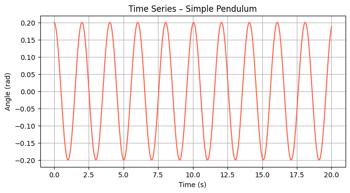
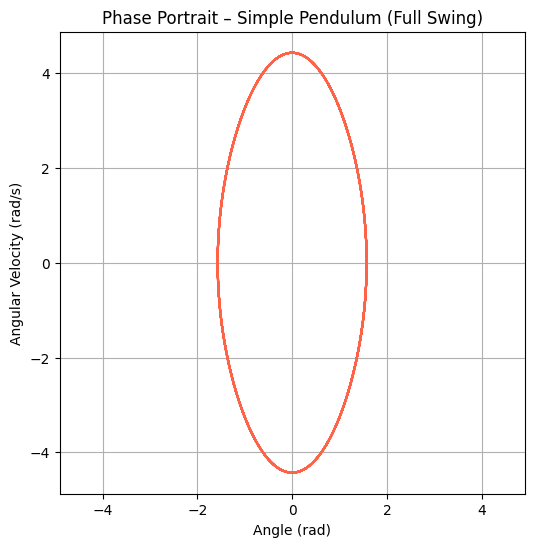

# Problem 1

# Introduction

## Overview of Projectile Motion
Projectile motion is a fundamental concept in physics that describes the motion of an object thrown into the air, subject only to the force of gravity and, in some cases, air resistance. The trajectory of such an object follows a parabolic path, governed by the equations of kinematics. Understanding projectile motion is crucial in various scientific and engineering fields, as it provides insights into motion under constant acceleration.

## Motivation for Investigating the Range as a Function of the Angle of Projection
One of the most intriguing aspects of projectile motion is how the horizontal range depends on the angle of projection. By analyzing this relationship, we gain deeper insights into optimizing trajectories for maximum distance, which has practical applications in numerous disciplines. This investigation helps in understanding the interplay between initial velocity, gravitational acceleration, and launch height, all of which influence the range of a projectile.

Furthermore, by examining how the range varies with different angles, we can derive the optimal launch conditions for achieving maximum distance. This knowledge is particularly useful in sports, engineering, and aerospace applications.

## Real-World Applications
Understanding the dependence of range on the angle of projection has numerous real-world applications, including:

- **Sports**: Optimizing the angle for maximum range in activities such as soccer, basketball, javelin throw, and golf.
- **Engineering**: Designing efficient projectile-based systems such as water jets, ballistic missiles, and mechanical launchers.
- **Aerospace**: Calculating optimal launch angles for rockets and space probes to achieve desired trajectories with minimal energy expenditure.

By investigating the mathematical and computational aspects of projectile motion, we can develop better predictive models and enhance real-world applications where trajectory optimization is essential.

# Theoretical Foundation

## Governing Equations of Motion
Projectile motion can be analyzed by breaking it into horizontal and vertical components. These components are governed by kinematic equations under the influence of gravity.

### Horizontal Motion
Since there are no external forces acting in the horizontal direction (assuming air resistance is negligible), the horizontal velocity remains constant:

$$x = v_0 \cos(\theta) t$$

where:
- $x$ is the horizontal displacement,
- $v_0$ is the initial velocity,
- $\theta$ is the launch angle,
- $t$ is the time of flight.

### Vertical Motion
The vertical motion is influenced by gravity, following these equations:

$$y = v_0 \sin(\theta) t - \frac{1}{2} g t^2$$

$$v_y = v_0 \sin(\theta) - g t$$

where:
- $y$ is the vertical displacement,
- $v_y$ is the vertical velocity at time $t$,
- $g$ is the acceleration due to gravity.

## Deriving the Range Equation
The total time of flight $T$ can be found by setting $y = 0$ (when the projectile returns to its original launch height):

$$0 = v_0 \sin(\theta) T - \frac{1}{2} g T^2$$

Solving for $T$:

$$T = \frac{2 v_0 \sin(\theta)}{g}$$

Substituting this into the horizontal motion equation to find the range $R$:

$$R = v_0 \cos(\theta) T$$

$$R = v_0 \cos(\theta) \times \frac{2 v_0 \sin(\theta)}{g}$$

Using the trigonometric identity $2 \sin(\theta) \cos(\theta) = \sin(2\theta)$, we get:

$$R = \frac{v_0^2 \sin(2\theta)}{g}$$

## Effect of Varying Initial Conditions
Several factors influence the projectile’s range:

- **Initial velocity ($v_0$)**: Increasing $v_0$ increases the range quadratically, as $R \propto v_0^2$.
- **Launch angle ($\theta$)**: The range is maximized at $45^\circ$ for a given $v_0$ in an ideal case with no air resistance.
- **Gravitational acceleration ($g$)**: A higher $g$ reduces the range, which is why projectiles travel farther on planets with lower gravity.
- **Launch height**: If the projectile is launched from an elevated height, the time of flight increases, generally increasing the range.

This theoretical foundation forms the basis for further numerical simulations and real-world applications of projectile motion.

# Analysis of the Range
 

## Dependence of the Horizontal Range on the Projection Angle
The horizontal range of a projectile is a function of its initial velocity, launch angle, and gravitational acceleration. The range $R$ can be expressed as:

$$R = \frac{v_0^2 \sin(2\theta)}{g}$$

From this equation, we can observe that the range depends on the angle of projection $\theta$ in a sine function. Since $\sin(2\theta)$ varies between -1 and 1, the range will have a maximum value when $2\theta = 90^\circ$, i.e., $\theta = 45^\circ$.

### Optimal Angle for Maximum Range under Ideal Conditions
In the ideal case, with no air resistance and constant gravitational acceleration, the optimal angle for achieving the maximum range is $45^\circ$. This angle maximizes the value of $\sin(2\theta)$, which is equal to 1. Therefore, for a given initial velocity, the range $R$ will be:

$$R_{\text{max}} = \frac{v_0^2}{g}$$

Thus, under ideal conditions, launching a projectile at a $45^\circ$ angle yields the maximum horizontal range.

## Influence of Various Factors on the Range

### Initial Velocity ($v_0$)
The initial velocity directly influences the horizontal range, as seen from the equation:

$$R = \frac{v_0^2 \sin(2\theta)}{g}$$

The range is proportional to the square of the initial velocity ($v_0^2$). Therefore, increasing the initial velocity results in a quadratic increase in the range. This means that a small increase in the initial velocity can lead to a significant increase in the horizontal distance traveled by the projectile.

### Gravitational Acceleration ($g$)
The gravitational acceleration also plays a significant role in determining the range. As shown in the equation, the range is inversely proportional to $g$:

$$R = \frac{v_0^2 \sin(2\theta)}{g}$$

This means that a higher gravitational acceleration will reduce the range of the projectile. For example, projectiles on planets with stronger gravity (such as Earth) will have a shorter range compared to those on planets with weaker gravity (such as Mars). The range decreases as $g$ increases.

### Launch Height
The launch height of the projectile can also affect its range. When a projectile is launched from an elevated position, the time of flight increases, leading to a longer horizontal range. The range equation for a projectile launched from a height $h$ is more complicated, as it requires solving for the time of flight considering both the vertical and horizontal motions. However, in general:

- A greater launch height will increase the time of flight, allowing the projectile to travel farther horizontally.

## Non-Ideal Conditions

### Air Resistance
Air resistance is a real-world factor that can significantly alter the trajectory of a projectile. In the presence of air resistance, the horizontal and vertical motions are no longer independent, and the equations of motion become more complex. The range will no longer follow the simple parabolic path described by the ideal equations. Air resistance acts to reduce the horizontal velocity and can cause the projectile to fall short of its expected range.

The drag force due to air resistance is typically modeled as:

$$F_{\text{drag}} = \frac{1}{2} C_d \rho A v^2$$

where:
- $C_d$ is the drag coefficient,
- $\rho$ is the air density,
- $A$ is the cross-sectional area of the projectile,
- $v$ is the velocity of the projectile.

This force will decelerate the projectile, reducing the range and altering the optimal angle of projection.

### Varying Gravitational Fields
In some cases, the gravitational field may not be constant. For example, in the case of a projectile launched on a planet with varying gravity or on a very large scale such as in space, the gravitational acceleration $g$ may change with height or location. In such situations, the range equation must be modified to account for the changing gravitational field. A variable $g$ can make the optimal angle for maximum range change, as well as alter the general behavior of the projectile's trajectory.

In a non-uniform gravitational field, the gravitational acceleration at any point is given by:

$$g(r) = \frac{GM}{r^2}$$

where:
- $G$ is the gravitational constant,
- $M$ is the mass of the central body,
- $r$ is the distance from the center of the body.

This would require a more complex analysis involving the integration of the equations of motion to determine the range in such environments.

### Summary of Non-Ideal Effects
In non-ideal conditions, several factors can influence the range:

- **Air resistance**: Reduces the range by decelerating the projectile.
- **Varying gravitational fields**: Changes the gravitational acceleration and modifies the projectile's trajectory.
- **Launch height**: Increases the range by providing more time for horizontal motion.

These factors make the analysis of projectile motion more complex and require advanced modeling techniques for more accurate predictions.

# Practical Applications

## Sports

### Soccer
In soccer, understanding projectile motion is crucial for analyzing the trajectory of a kicked ball. The theoretical model of projectile motion allows players to determine the optimal launch angle for maximizing the range of the ball. While the ideal launch angle for maximum range is $45^\circ$, real-world conditions, such as air resistance and the shape of the ball, must be considered for more accurate predictions. For example, when a soccer ball is kicked with a curve, the ball's spin interacts with the air, altering the trajectory.

In free-kick situations, players must adjust their launch angle and initial velocity based on the distance to the goal, considering both the theoretical and practical aspects of projectile motion.

### Basketball
Basketball also relies on projectile motion, especially when shooting the ball towards the hoop. The optimal angle for a successful shot is typically between $45^\circ$ and $60^\circ$. Factors like the player's distance from the hoop and the ball's spin affect the trajectory. The theoretical model can guide players in understanding the relationship between the angle of launch, velocity, and trajectory, although practical considerations such as wind resistance (in outdoor settings) and spin on the ball must be accounted for.

In practice, players adjust for various environmental conditions, such as air resistance and the spin of the ball, which alter the projectile's path.

### Golf
Golf involves projecting a golf ball into the air with the goal of achieving maximum distance. The theoretical model of projectile motion helps golfers determine the optimal launch angle and velocity to maximize the range of the ball. In ideal conditions, a $45^\circ$ launch angle would achieve the greatest distance, but air resistance and weather conditions, such as wind and humidity, affect the trajectory and range.

Golfers adjust their swings based on factors like wind speed and direction, altitude, and temperature, which all influence the behavior of the ball's flight.

## Engineering

### Missile Trajectories
In engineering, the principles of projectile motion are essential for calculating the trajectory of missiles. The initial velocity, launch angle, and gravitational acceleration play a critical role in predicting where a missile will land. Engineers use the basic equations of projectile motion to calculate the missile's path in ideal conditions. However, in practice, air resistance, wind, and the Earth's curvature must also be taken into account.

Theoretical models are expanded to include drag forces, which slow down the missile and reduce its range. Advanced simulations, incorporating factors like atmospheric conditions, help engineers optimize missile trajectories for precision targeting.

### Water Jets
Water jets in engineering applications, such as fountains, irrigation systems, or fire hoses, rely on the principles of projectile motion. The launch angle and initial velocity of the water stream determine the distance it travels. Theoretical models of projectile motion can be used to predict the range and height of the water stream in ideal conditions, assuming no air resistance.

However, in real-world applications, factors like the nozzle's shape, air resistance, and the water's velocity must be accounted for in more advanced models to ensure the desired range and trajectory are achieved.

## Astrophysics

### Planetary Landers
In astrophysics, projectile motion models are used to predict the descent of planetary landers. The lander's trajectory is influenced by the planet's gravitational pull, the lander's initial velocity, and its entry angle. Theoretical models are useful for predicting the lander's path in ideal conditions, but practical factors like atmospheric drag, temperature variations, and terrain complexity must be accounted for to ensure a safe landing.

For example, during a Mars lander mission, engineers need to consider the planet's weaker gravity and atmospheric density to accurately model the lander's descent and make necessary adjustments.

### Space Launches
Space launches also rely on the principles of projectile motion to determine the optimal launch angle and trajectory of rockets. The rocket's initial velocity, launch angle, and gravitational forces are taken into account to ensure the rocket achieves the desired trajectory and reaches orbit. Theoretical models help predict the path of the rocket in ideal conditions, but real-world factors such as atmospheric drag, wind, and the Earth's rotation must also be considered.

Advanced simulations are used to account for the varying gravitational fields at different altitudes, as well as the rocket's propulsion system, to achieve a successful launch.

## Challenges in Applying the Theoretical Model to Practical Problems

### Wind Resistance
In real-world scenarios, air resistance (or drag) plays a crucial role in modifying the trajectory of a projectile. Wind resistance opposes the motion of the projectile, reducing its speed and range. The drag force can be modeled as:

$$F_{\text{drag}} = \frac{1}{2} C_d \rho A v^2$$

where:
- $C_d$ is the drag coefficient,
- $\rho$ is the air density,
- $A$ is the cross-sectional area of the projectile,
- $v$ is the velocity of the projectile.

As the projectile moves through the air, the velocity decreases, which leads to a shorter range. Air resistance alters the optimal angle of launch and the general trajectory, requiring more sophisticated models that include these factors.

### Turbulence
Turbulence is another challenge that complicates the application of the theoretical model. In turbulent airflows, the irregular motion of the air can cause unpredictable changes in the projectile's path. The chaotic nature of turbulence makes it difficult to model accurately, as small variations in airflow can result in large deviations in trajectory.

In practical applications like sports or engineering, understanding and accounting for turbulence is necessary for accurate predictions. However, turbulence is highly complex, requiring advanced fluid dynamics models to capture its effects on the projectile’s motion.

### Non-Uniform Gravitational Fields
The assumption of a constant gravitational field in the basic projectile motion model is not valid in many real-world applications. For instance, gravitational acceleration varies with altitude, and in some cases, such as on other planets, the gravitational field may be weaker or stronger than Earth's. This variation can affect the projectile’s range and trajectory.

For example, on Mars, where gravity is only about 38% of Earth's, projectiles will travel farther for the same initial velocity and launch angle. To account for varying gravitational fields, more complex models are used, often requiring numerical methods and simulations to predict the trajectory accurately.

### Uneven Terrain
Uneven terrain can also affect the application of the projectile motion model. The basic model assumes flat ground, but in real-world situations, terrain may include hills, valleys, or other obstacles that alter the projectile's flight path. The launch angle and velocity will also vary depending on the elevation of the launch point and the target.

In engineering, missile and water jet trajectory predictions must incorporate terrain data to ensure accuracy. Similarly, in sports like golf, terrain features such as elevation differences or wind gusts caused by nearby mountains can change how the ball behaves.

# Implementation

## Python Script for Simulating Projectile Motion

In this section, we will develop a Python script that simulates projectile motion for various initial conditions and visualizes the range versus angle of projection using plots. The script will also compare analytical and numerical solutions to demonstrate the validity of the theoretical model.

We will use the following approach:

- **Simulate projectile motion** for different initial conditions.
- **Visualize range vs. angle** with a plot.
- **Compare analytical and numerical solutions**.
- **Use numerical methods** such as Euler’s method when necessary.

### Code Implementation

import numpy as np
import matplotlib.pyplot as plt

# Constants
g = 9.81  # Gravitational acceleration (m/s^2)

# Function to calculate the range of a projectile based on initial velocity and angle
def analytical_range(v0, theta):
    """
    Calculate the range of a projectile using the analytical formula.
    :param v0: initial velocity (m/s)
    :param theta: launch angle in degrees
    :return: range (m)
    """
    theta_rad = np.radians(theta)
    return (v0**2 * np.sin(2 * theta_rad)) / g

# Function to simulate projectile motion using numerical methods (Euler's method)
def simulate_projectile(v0, theta, dt=0.01, max_time=10):
    """
    Simulate the projectile motion using Euler's method.
    :param v0: initial velocity (m/s)
    :param theta: launch angle in degrees
    :param dt: time step for numerical simulation
    :param max_time: maximum time to simulate
    :return: time, x (horizontal displacement), y (vertical displacement)
    """
    theta_rad = np.radians(theta)
    vx = v0 * np.cos(theta_rad)
    vy = v0 * np.sin(theta_rad)
    
    x = 0
    y = 0
    t = 0
    time = [t]
    x_vals = [x]
    y_vals = [y]
    
    while y >= 0 and t <= max_time:  # Until the projectile hits the ground
        ax = 0  # No horizontal acceleration
        ay = -g  # Vertical acceleration due to gravity
        
        # Update velocity and position
        vx += ax * dt
        vy += ay * dt
        x += vx * dt
        y += vy * dt
        t += dt
        
        time.append(t)
        x_vals.append(x)
        y_vals.append(y)
    
    return np.array(time), np.array(x_vals), np.array(y_vals)

# Function to compare analytical and numerical solutions for range vs. angle
def plot_range_vs_angle(v0, angles):
    """
    Plot range vs. angle for both analytical and numerical solutions.
    :param v0: initial velocity (m/s)
    :param angles: list of launch angles (degrees)
    """
    analytical_ranges = [analytical_range(v0, angle) for angle in angles]
    numerical_ranges = [simulate_projectile(v0, angle)[1][-1] for angle in angles]
    
    plt.figure(figsize=(10, 6))
    plt.plot(angles, analytical_ranges, label="Analytical Solution", color='blue', linestyle='--')
    plt.plot(angles, numerical_ranges, label="Numerical Solution (Euler's Method)", color='red', linestyle='-')
    plt.xlabel('Launch Angle (degrees)')
    plt.ylabel('Range (m)')
    plt.title(f'Projectile Range vs. Angle for v0 = {v0} m/s')
    plt.legend()
    plt.grid(True)
    plt.show()

# Example usage: Simulate for initial velocity v0 = 30 m/s and a range of angles
v0 = 30  # Initial velocity in m/s
angles = np.arange(0, 91, 1)  # Launch angles from 0 to 90 degrees
plot_range_vs_angle(v0, angles)

# 7. Limitations and Extensions

## Limitations of the Idealized Model

The theoretical model presented in previous sections assumes ideal conditions, which may not fully represent real-world scenarios. Some of the key limitations of the idealized model are:

- **No Air Resistance**: The model assumes that there is no air resistance acting on the projectile, which is not true in most practical situations. Air resistance slows down the projectile and reduces its range, particularly at higher speeds and for larger projectiles.
  
- **Uniform Gravity**: The model assumes that gravitational acceleration \(g\) is constant and uniform over the trajectory. However, gravity varies with altitude, and more significantly, the gravitational fields of different planets are not the same. For instance, gravity on Mars is much weaker than on Earth, affecting the range of the projectile.

- **Flat Terrain**: The model assumes that the projectile is launched from flat terrain and that the trajectory is not influenced by variations in the landscape. In real-life applications, such as in sports or military contexts, the terrain can significantly alter the trajectory.

- **Ideal Launch Conditions**: The model assumes that the projectile is launched in ideal conditions with no imperfections in the angle of projection or initial velocity. In reality, the angle may not be perfectly controlled, and variations in the launch velocity can occur.

## Suggested Improvements and Extensions

To make the model more realistic and applicable to a wider range of scenarios, several improvements and extensions could be implemented:

### 1. **Including Drag Force in Calculations**

The most significant extension would be to incorporate the effect of air resistance or drag force into the calculations. Air resistance affects both the horizontal and vertical components of motion and can significantly change the trajectory of the projectile. The drag force \( F_d \) is often modeled as:

$$
F_d = \frac{1}{2} C_d \rho A v^2
$$

Where:
- \( C_d \) is the drag coefficient (which depends on the shape of the projectile),
- \( \rho \) is the air density,
- \( A \) is the cross-sectional area of the projectile,
- \( v \) is the velocity of the projectile.

This would make the model more realistic and applicable to real-world scenarios, such as sports or engineering projects.

### 2. **Accounting for Varying Terrain**

In practical applications, terrain is rarely flat. The model can be extended to account for varying terrain or elevation changes by including a height function that adjusts the projectile’s position based on the terrain profile. For example, if the projectile is launched uphill or downhill, the trajectory should reflect these changes in elevation.

### 3. **Applying Machine Learning Techniques to Fit Real-World Data**

Another possible extension involves using machine learning to improve the model’s predictions based on real-world data. For example, data collected from projectile launches in sports (e.g., golf or basketball) or engineering (e.g., missile trajectories) could be used to train a machine learning model that predicts the range based on input features such as launch angle, initial velocity, and environmental conditions. This could help fine-tune the theoretical model by adjusting for factors such as wind speed, temperature, and launch imperfections.

### 4. **Non-Uniform Gravitational Fields**

For applications in aerospace or astrophysics, it is essential to account for the non-uniform gravitational fields encountered in different planets or even varying altitudes on Earth. The gravitational acceleration decreases with altitude, and in orbital mechanics, gravity varies with the position relative to the planet’s center. Incorporating these effects would make the model applicable for space missions and interplanetary projectile motion.

### 5. **Accounting for Wind and Turbulence**

Wind and turbulence can drastically change the trajectory of a projectile. To account for these factors, wind velocity and direction can be modeled as functions of time and position. Turbulence, which can be highly unpredictable, may be more challenging to model accurately, but some statistical or probabilistic models can be used to simulate its effects.

### 6. **Real-Time Adjustments for Launch Parameters**

In some situations, such as sports, real-time adjustments to the launch angle or velocity may be needed for optimal performance. Implementing a feedback system that adjusts these parameters based on real-time observations (e.g., in golf, adjusting swing angle or speed) could be an interesting extension. This would involve a more dynamic simulation and possibly integrate sensors to measure projectile properties during flight.

## Conclusion

The idealized model of projectile motion provides a good starting point for understanding the basic principles of motion under constant acceleration. However, to apply it to real-world scenarios, we must extend it by incorporating factors such as air resistance, terrain variations, and non-uniform gravitational fields. Using advanced methods such as machine learning and real-time adjustments can also improve the model’s accuracy and applicability in fields like sports, engineering, and space exploration.

