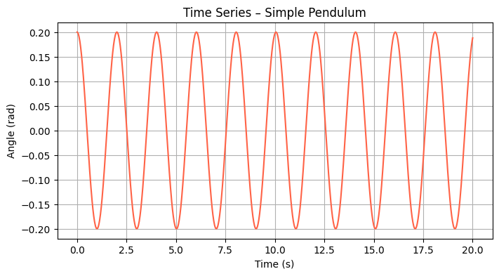
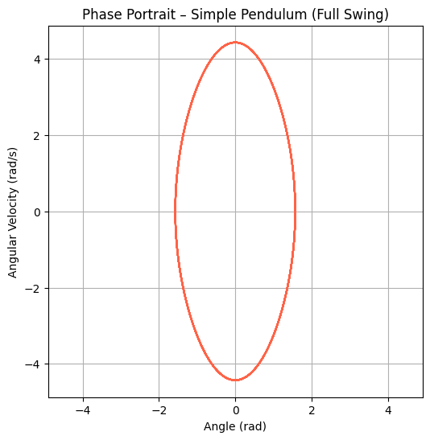
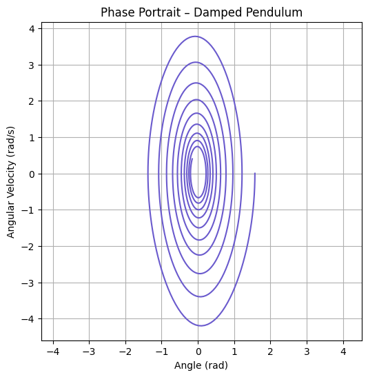
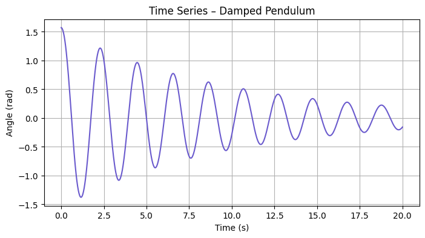
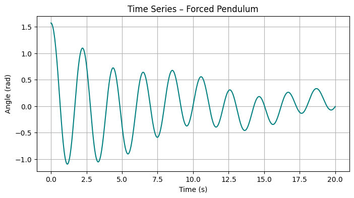
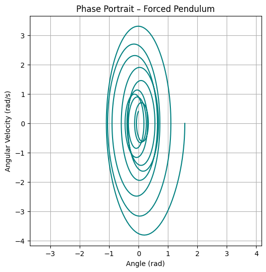
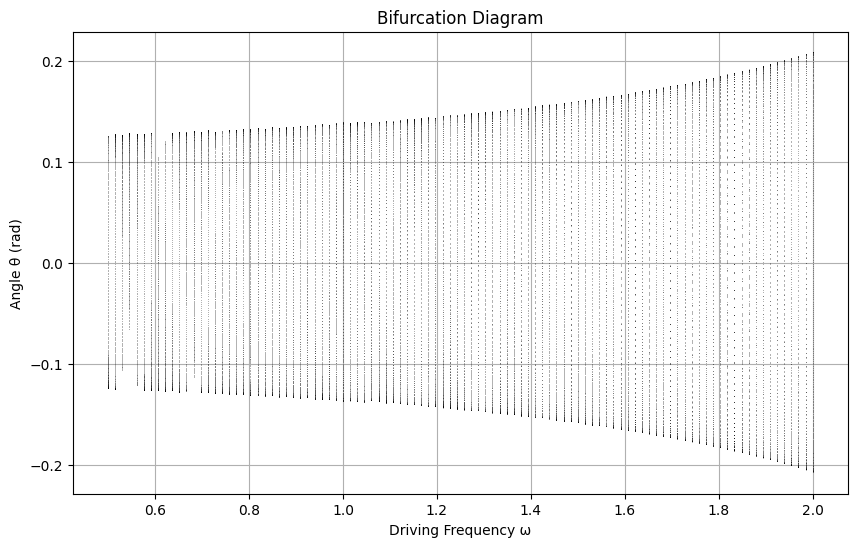

# Problem 2: Investigating the Dynamics of a Forced Damped Pendulum

## Motivation:
The **forced damped pendulum** is a captivating example of a physical system with intricate behavior resulting from the interplay of **damping**, **restoring forces**, and **external driving forces**. By introducing both damping and external periodic forcing, the system demonstrates a transition from **simple harmonic motion** to a rich spectrum of dynamics, including **resonance**, **chaos**, and **quasiperiodic behavior**. These phenomena serve as a foundation for understanding complex real-world systems, such as driven oscillators, climate systems, and mechanical structures under periodic stress.

Adding forcing introduces new parameters, such as the **amplitude** and **frequency** of the external force, which significantly affect the pendulum's behavior. By systematically varying these parameters, a diverse class of solutions can be observed, including synchronized oscillations, chaotic motion, and resonance phenomena. These behaviors not only highlight fundamental physics principles but also provide insights into engineering applications such as **energy harvesting**, **vibration isolation**, and **mechanical resonance**.

## Task:

### 1. Theoretical Foundation:

 

- Start with the differential equation governing the motion of a **forced damped pendulum**:
  $$
  \frac{d^2 \theta}{dt^2} + 2 \gamma \frac{d\theta}{dt} + \omega_0^2 \sin(\theta) = A \cos(\omega t)
  $$

- Derive the approximate solutions for **small-angle oscillations**.
- Explore **resonance conditions** and their implications for the system's energy.

 

### 2. Analysis of Dynamics:

- Investigate how the **damping coefficient**, **driving amplitude**, and **driving frequency** influence the motion of the pendulum.
- Examine the **transition between regular and chaotic motion** and their physical interpretations.

### 3. Practical Applications:

- Discuss real-world scenarios where the **forced damped pendulum** model applies, such as in **energy harvesting devices**, **suspension bridges**, and **oscillating circuits**.
 

### 4. Implementation:
- Create a **computational model** to simulate the motion of a **forced damped pendulum**.
- Visualize the behavior under various **damping**, **driving force**, and **initial conditions**.
- Plot **phase diagrams** and **Poincaré sections** to illustrate transitions to chaos.

## Deliverables:
- A **Markdown document** with **Python script** or notebook implementing the simulations.
- A detailed explanation of the general solutions for the **forced damped pendulum**.
- **Graphical representations** of the motion for different **damping coefficients**, **driving amplitudes**, and **driving frequencies**, including resonance and chaotic behavior.
- A discussion on the **limitations of the model** and potential extensions, such as introducing **nonlinear damping** or **non-periodic driving forces**.
- **Phase portraits**, **Poincaré sections**, and **bifurcation diagrams** to analyze transitions to complex dynamics.

## Hints and Resources:
- For small angles, approximate $\sin(\theta) \approx \theta$ to simplify the differential equation.
- Employ **numerical techniques** (e.g., **Runge-Kutta methods**) for exploring the dynamics beyond the small-angle approximation.
- Relate the **forced damped pendulum** to analogous systems in other fields, such as **electrical circuits** (driven RLC circuits) or **biomechanics** (human gait).
- Utilize software tools like **Python** for simulations and visualizations.

This task bridges theoretical analysis with computational exploration, fostering a deeper understanding of forced and damped oscillatory phenomena and their implications in both physics and engineering.

 

[My Colab](https://colab.research.google.com/drive/1qP4dBedUpvvfWsVxY26c0vqmXayg90XI#scrollTo=G9rPV8yD-MIY)
