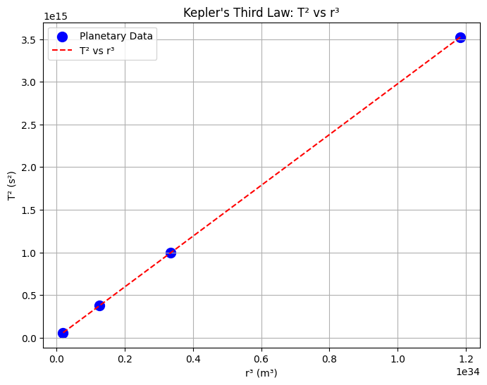

# Problem 1: Orbital Period and Orbital Radius (Kepler's Third Law)

## Derivation of Kepler's Third Law:

Kepler’s Third Law states that for objects orbiting a central body, the square of the orbital period \( T \) is proportional to the cube of the orbital radius \( r \), mathematically:

$$
T^2 \propto r^3
$$

### Step-by-Step Derivation:

1. **Centripetal Force and Gravitational Force:**

   For a satellite of mass \( m \) orbiting a body of mass \( M \), the gravitational force provides the necessary centripetal force to keep the satellite in its circular orbit.

   The gravitational force between two bodies is given by Newton’s law of gravitation:

   $$
   F_{\text{gravity}} = \frac{GMm}{r^2}
   $$

   where:
   - \( G \) is the gravitational constant (\( 6.674 \times 10^{-11} \, \text{Nm}^2/\text{kg}^2 \)),
   - \( M \) is the mass of the central body (e.g., Sun or Earth),
   - \( m \) is the mass of the orbiting object (e.g., planet or satellite),
   - \( r \) is the orbital radius (distance from the center of the central body to the orbiting object).

   The centripetal force required to keep the object in orbit is:

   $$
   F_{\text{centripetal}} = \frac{mv^2}{r}
   $$

   where \( v \) is the orbital speed of the object.

2. **Equating the Forces:**

   Since the gravitational force provides the centripetal force, we set these two forces equal:

   $$
   \frac{GMm}{r^2} = \frac{mv^2}{r}
   $$

   Simplifying this equation by canceling out \( m \) and \( r \) (assuming \( m \neq 0 \)):

   $$
   \frac{GM}{r} = v^2
   $$

   Thus, the orbital speed \( v \) is:

   $$
   v = \sqrt{\frac{GM}{r}}
   $$

3. **Orbital Period \( T \):**

   The orbital period \( T \) is the time it takes for the orbiting object to complete one full orbit. The relationship between orbital speed and orbital period is:

   $$
   v = \frac{2 \pi r}{T}
   $$

   Rearranging for \( T \):

   $$
   T = \frac{2 \pi r}{v}
   $$

   Substituting the expression for \( v \) from earlier:

   $$
   T = \frac{2 \pi r}{\sqrt{\frac{GM}{r}}}
   $$

   Simplifying:

   $$
   T = 2 \pi \sqrt{\frac{r^3}{GM}}
   $$

4. **Final Form of Kepler's Third Law:**

   Therefore, the orbital period \( T \) is related to the orbital radius \( r \) by:

   $$
   T^2 = \frac{4 \pi^2}{GM} r^3
   $$

   This equation shows that \( T^2 \propto r^3 \), which is Kepler’s Third Law.

---

## T² vs r³ Plot:

To show the relationship between \( T^2 \) and \( r^3 \) for planets in our Solar System, we will create a plot. The x-axis will represent the cube of the orbital radius (\( r^3 \)), and the y-axis will represent the square of the orbital period (\( T^2 \)).

[My Colab](https://colab.research.google.com/drive/1qP4dBedUpvvfWsVxY26c0vqmXayg90XI#scrollTo=G9rPV8yD-MIY)

# Data for the planets in the Solar System (orbital radius in meters and orbital period in seconds)
planet_data = {
    'Mercury': {'r': 5.79e10, 'T': 0.241 * 365 * 24 * 3600},  # Period in seconds
    'Venus': {'r': 1.082e11, 'T': 0.615 * 365 * 24 * 3600},
    'Earth': {'r': 1.496e11, 'T': 365 * 24 * 3600},
    'Mars': {'r': 2.279e11, 'T': 687 * 24 * 3600}
}

# Calculate T^2 and r^3 for the planets
r_cubed = [data['r']**3 for data in planet_data.values()]
T_squared = [data['T']**2 for data in planet_data.values()]

# Plot the data
plt.figure(figsize=(8, 6))
plt.scatter(r_cubed, T_squared, color='blue', label="Planetary Data", s=100)
plt.plot(np.array(r_cubed), np.array(T_squared), color='red', linestyle='--', label="T² vs r³")
plt.xlabel("r³ (m³)")
plt.ylabel("T² (s²)")
plt.title("Kepler's Third Law: T² vs r³")
plt.legend()
plt.grid(True)
plt.show()

