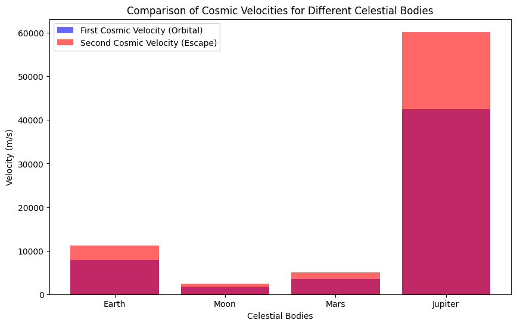

# Escape Velocities and Cosmic Velocities

## Introduction

In space exploration, understanding the escape velocity and cosmic velocities is crucial to designing space missions. These velocities define the conditions needed to break free from the gravitational influence of celestial bodies. The **first**, **second**, and **third cosmic velocities** determine whether an object can:

1. **Orbit** the body (first cosmic velocity),
2. **Escape** from the gravitational pull (second cosmic velocity), or
3. **Leave** the gravitational influence of the star system entirely (third cosmic velocity).

---

## Derivation of Cosmic Velocities

### 1. **First Cosmic Velocity (Orbital Velocity)**

The **first cosmic velocity** is the velocity required for an object to enter a circular orbit around a celestial body. It is derived from the balance between the object's centripetal force and the gravitational force pulling it toward the body.

**Formula:**

The centripetal force required to maintain a circular orbit is given by:

$$ F_{c} = \frac{m v^2}{r} $$

The gravitational force is:

$$ F_{g} = \frac{G M m}{r^2} $$

Where:
- \( m \) is the mass of the orbiting object,
- \( M \) is the mass of the central body (e.g., Earth),
- \( r \) is the distance from the center of the body,
- \( G \) is the gravitational constant,
- \( v \) is the orbital velocity.

Setting \( F_c = F_g \) gives:

$$ \frac{m v^2}{r} = \frac{G M m}{r^2} $$

Solving for \( v \), we get the first cosmic velocity:

$$ v_1 = \sqrt{\frac{GM}{r}} $$

### 2. **Second Cosmic Velocity (Escape Velocity)**

The **second cosmic velocity** is the velocity required for an object to escape the gravitational pull of the body without further propulsion. It is derived from the conservation of energy principle.

The total energy of the system consists of kinetic energy and gravitational potential energy:

$$ E = \frac{1}{2} m v^2 - \frac{G M m}{r} $$

For an object to escape, the total energy must be zero (i.e., the object just escapes without falling back):

$$ 0 = \frac{1}{2} m v^2 - \frac{G M m}{r} $$

Solving for \( v \), we get the second cosmic velocity:

$$ v_2 = \sqrt{\frac{2GM}{r}} $$

### 3. **Third Cosmic Velocity (Escape from the Solar System)**

The **third cosmic velocity** is the velocity required to escape the gravitational influence of a star (e.g., the Sun) and travel into interstellar space. It is derived from the total energy needed to escape the combined gravitational fields of the central body and the star.

For an object to escape the solar system from the surface of a planet, it must overcome the gravitational influence of both the planet and the Sun.

The third cosmic velocity is given by:

$$ v_3 = \sqrt{\frac{3GM_{\text{sun}}}{r_{\text{earth}}}} $$

Where:
- \( G \) is the gravitational constant,
- \( M_{\text{sun}} \) is the mass of the Sun,
- \( r_{\text{earth}} \) is the distance from the Earth to the Sun.

---

## Calculation of Cosmic Velocities for Earth


Given the following constants:
- Gravitational constant \( G = 6.67430 \times 10^{-11} \, \text{m}^3 \text{kg}^{-1} \text{s}^{-2} \),
- Earth's mass \( M_{\text{earth}} = 5.972 \times 10^{24} \, \text{kg} \),
- Earth's radius \( r_{\text{earth}} = 6.378 \times 10^6 \, \text{m} \),
- Distance from Earth to Sun \( r_{\text{sun-earth}} = 1.496 \times 10^{11} \, \text{m} \),
- Mass of the Sun \( M_{\text{sun}} = 1.989 \times 10^{30} \, \text{kg} \).

We can now calculate the three cosmic velocities.


[My Colab](https://colab.research.google.com/drive/1qP4dBedUpvvfWsVxY26c0vqmXayg90XI#scrollTo=G9rPV8yD-MIY)


```python
import math

# Constants
G = 6.67430e-11  # Gravitational constant in m^3 kg^-1 s^-2
M_earth = 5.972e24  # Mass of Earth in kg
r_earth = 6.378e6  # Radius of Earth in meters
r_sun_earth = 1.496e11  # Distance from Earth to Sun in meters
M_sun = 1.989e30  # Mass of the Sun in kg

# First cosmic velocity (Orbital velocity)
v1_earth = math.sqrt(G * M_earth / r_earth)

# Second cosmic velocity (Escape velocity)
v2_earth = math.sqrt(2 * G * M_earth / r_earth)

# Third cosmic velocity (Escape from the Solar System)
v3_earth = math.sqrt(3 * G * M_sun / r_sun_earth)

(v1_earth, v2_earth, v3_earth)

# Constants for other celestial bodies
M_moon = 7.342e22  # Mass of the Moon in kg
r_moon = 1.737e6  # Radius of the Moon in meters

M_mars = 6.417e23  # Mass of Mars in kg
r_mars = 3.396e6  # Radius of Mars in meters

M_jupiter = 1.898e27  # Mass of Jupiter in kg
r_jupiter = 6.991e7  # Radius of Jupiter in meters

# Function to calculate the velocities
def cosmic_velocities(M, r):
    v1 = math.sqrt(G * M / r)
    v2 = math.sqrt(2 * G * M / r)
    return v1, v2

# Calculate velocities for each body
v1_moon, v2_moon = cosmic_velocities(M_moon, r_moon)
v1_mars, v2_mars = cosmic_velocities(M_mars, r_mars)
v1_jupiter, v2_jupiter = cosmic_velocities(M_jupiter, r_jupiter)

(v1_moon, v2_moon), (v1_mars, v2_mars), (v1_jupiter, v2_jupiter)

import matplotlib.pyplot as plt

# Data for visualization
bodies = ['Earth', 'Moon', 'Mars', 'Jupiter']
v1_values = [v1_earth, v1_moon, v1_mars, v1_jupiter]
v2_values = [v2_earth, v2_moon, v2_mars, v2_jupiter]

# Plotting
fig, ax = plt.subplots(figsize=(10, 6))

# Bar chart for the velocities
ax.bar(bodies, v1_values, label='First Cosmic Velocity (Orbital)', alpha=0.6, color='blue')
ax.bar(bodies, v2_values, label='Second Cosmic Velocity (Escape)', alpha=0.6, color='red')

# Adding labels and title
ax.set_xlabel('Celestial Bodies')
ax.set_ylabel('Velocity (m/s)')
ax.set_title('Comparison of Cosmic Velocities for Different Celestial Bodies')
ax.legend()

plt.show()
