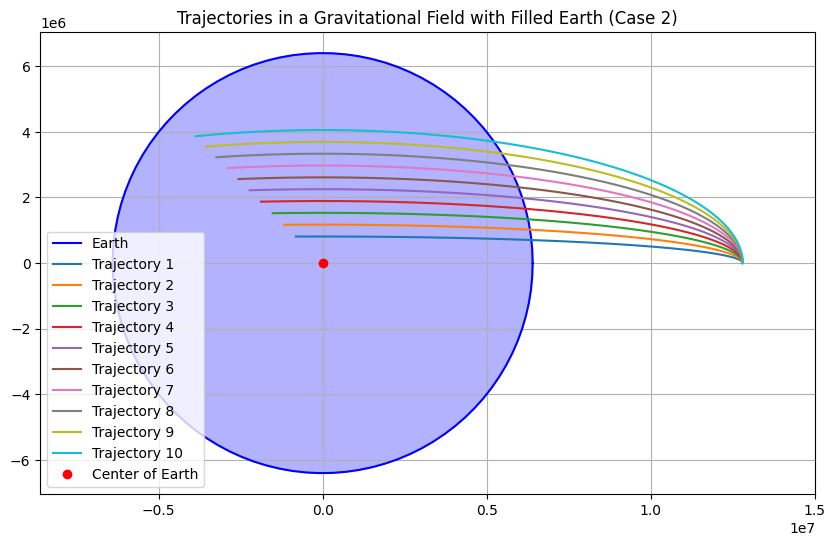
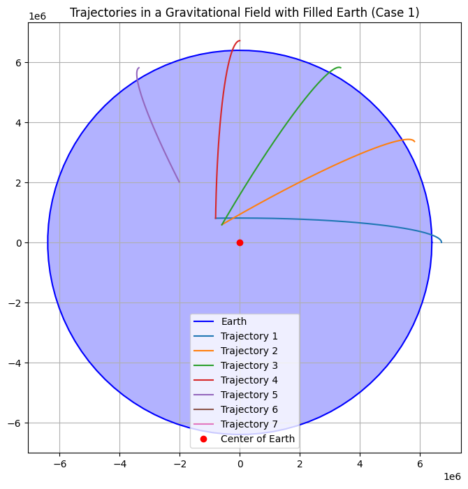

# Problem 3: Trajectories of a Freely Released Payload Near Earth

## Motivation

When a payload is released from a moving rocket near Earth, its trajectory is influenced by initial conditions, gravitational forces, and the velocity of the payload. The goal of this simulation is to analyze different potential trajectories of a payload launched from an altitude of 800 km above Earth, under the influence of Earth's gravity.

We will consider different initial velocities, ranging from 5 km/s to 13 km/s, to understand the relationship between velocity and trajectory type (parabolic, hyperbolic, elliptical).

## Approach

The motion of a payload near Earth can be modeled using Newton's law of gravitation:

$$
F = \frac{G M m}{r^2}
$$

Where:
- \( F \) is the gravitational force,
- \( G \) is the gravitational constant,
- \( M \) is the mass of Earth,
- \( m \) is the mass of the payload,
- \( r \) is the distance between the center of the Earth and the payload.

### Orbital Mechanics Considerations

- **Escape velocity**: The minimum velocity needed for an object to break free from Earth's gravity. This is given by:

$$
v_{escape} = \sqrt{\frac{2GM}{r}}
$$

- **Orbital trajectory**: The path followed by an object under the influence of gravity, which can be elliptical, parabolic, or hyperbolic depending on the initial velocity.

## Setup

1. **Initial Conditions**: 
    - Payload initial position is 800 km above Earth's surface, so the initial radius \( r = 800 \text{ km} + 6371 \text{ km} \) (Earth's radius).
    - The payload is released with initial velocities of 5 km/s, 5.5 km/s, up to 13 km/s.

2. **Simulation**:
    - The simulation will compute the trajectory by solving the equations of motion under gravitational influence numerically.
    - We will plot the Earth's position as a circle and the payload trajectory for each initial velocity.






[My Colab](https://colab.research.google.com/drive/1qP4dBedUpvvfWsVxY26c0vqmXayg90XI#scrollTo=G9rPV8yD-MIY)


## Python Code Implementation

### Libraries

```python
import numpy as np
import matplotlib.pyplot as plt
from scipy.integrate import odeint

# Constants
G = 6.67430e-11  # gravitational constant in m^3 kg^-1 s^-2
M = 5.972e24  # mass of Earth in kg
R_earth = 6371e3  # radius of Earth in meters
initial_altitude = 800e3  # altitude above Earth's surface in meters

# Function to compute the derivatives (dx/dt, dy/dt, dVx/dt, dVy/dt)
def equations(state, t, velocity_initial):
    x, y, vx, vy = state
    r = np.sqrt(x**2 + y**2)  # distance from Earth's center
    
    # Gravitational force
    F_gravity = -G * M / r**2
    
    # Acceleration components
    ax = F_gravity * x / r
    ay = F_gravity * y / r
    
    return [vx, vy, ax, ay]

# Initial conditions (position and velocity)
# Payload is released from 800 km above the Earth's surface
r_initial = R_earth + initial_altitude
theta = np.pi / 2  # position angle (straight up from the surface)
x_initial = r_initial * np.cos(theta)
y_initial = r_initial * np.sin(theta)

# Different initial velocities (in km/s, converted to m/s)
velocities = np.linspace(5000, 13000, 9)  # Initial velocities from 5 km/s to 13 km/s
colors = plt.cm.viridis(np.linspace(0, 1, len(velocities)))  # Color map for plotting

# Time array for simulation (0 to 10,000 seconds)
t = np.linspace(0, 10000, 1000)

# Plot setup
fig, ax = plt.subplots(figsize=(8, 8))
ax.set_aspect('equal')
ax.set_xlabel('x (m)')
ax.set_ylabel('y (m)')
ax.set_title('Trajectories of Payloads Near Earth')

# Plot the Earth as a circle
earth_circle = plt.Circle((0, 0), R_earth, color='b', label="Earth", alpha=0.5)
ax.add_artist(earth_circle)

# Simulate for each initial velocity
for v in velocities:
    # Initial velocities in x and y directions (m/s)
    vx_initial = v * np.cos(theta)
    vy_initial = v * np.sin(theta)

    # Initial state: [x, y, vx, vy]
    state_initial = [x_initial, y_initial, vx_initial, vy_initial]

    # Solve the equations of motion using odeint
    trajectory = odeint(equations, state_initial, t, args=(v,))

    # Plot the trajectory
    ax.plot(trajectory[:, 0], trajectory[:, 1], label=f'v = {v / 1000} km/s', color=colors[int(v - 5000) // 500])

# Display the legend
ax.legend()

# Show the plot
plt.show()
