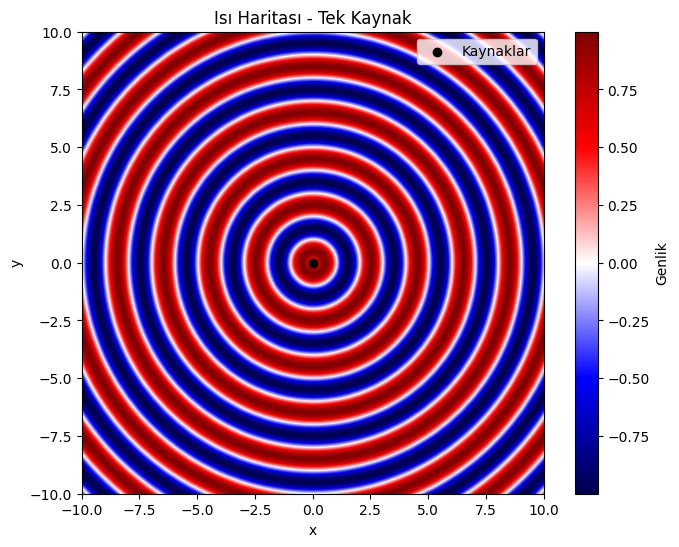
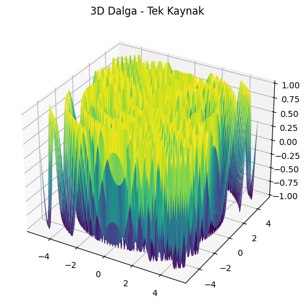
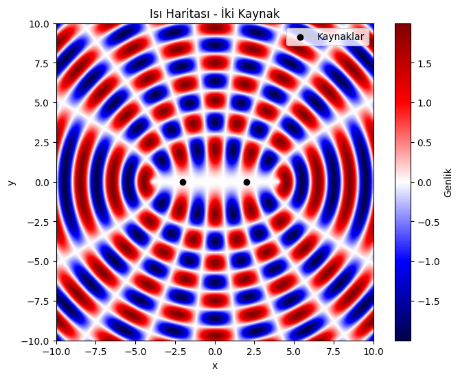
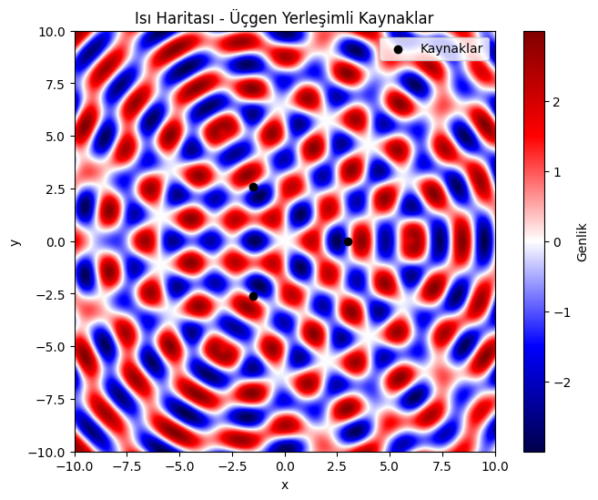
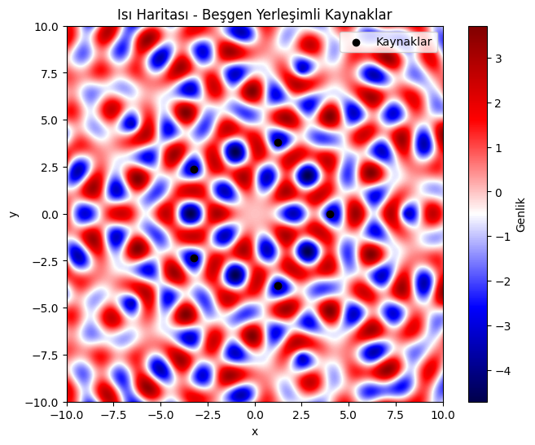

# Problem 1: Interference Patterns on a Water Surface

## Motivation

Interference patterns emerge when waves from different sources meet and superpose. On a water surface, such patterns are visually compelling and offer a practical demonstration of wave interference: **constructive interference** occurs when waves amplify each other, and **destructive interference** occurs when they cancel each other out.

This problem helps us analyze these patterns through a physical and mathematical lens, enhancing our understanding of wave superposition in a clear and intuitive way.

---

## Task Overview

You will:

- Select a regular polygon (e.g., square).
- Place identical point wave sources at its vertices.
- Use circular wave equations to simulate the disturbance.
- Superpose the wave functions to generate an interference pattern.
- Visualize the resulting pattern and highlight key features.

---

## Wave Equation

For a point source at position \( \vec{r}_0 = (x_0, y_0) \), the wave at a point \( \vec{r} = (x, y) \) and time \( t \) is given by:

$$
u(\vec{r}, t) = A \cdot \sin(k r - \omega t + \phi)
$$

Where:
- \( A \) = amplitude of wave,
- \( k = \frac{2\pi}{\lambda} \) = wave number,
- \( \omega = 2\pi f \) = angular frequency,
- \( r = |\vec{r} - \vec{r}_0| \) = distance from source to point,
- \( \phi \) = initial phase (same for all sources for coherence).

---

Analysis of Interference Pattern
Constructive Interference: Occurs at points where the waves from all sources arrive in phase (displacements add).

Destructive Interference: Occurs at points where the waves arrive out of phase, canceling each other out.

With a square configuration, you'll notice a grid-like interference structure with symmetric patterns centered around the polygon.

Key Observations:
The central region typically exhibits strong constructive interference.

Symmetric fringe patterns appear due to equal path differences from the sources.

Nodes and antinodes appear periodically depending on the wave parameters.

Extension Ideas
Try different polygons (triangle, pentagon, hexagon).

Vary the wavelength, frequency, or phases.

Animate over time 
𝑡
t to see how the wave pattern evolves dynamically.

Conclusion
This simulation clearly demonstrates how interference arises from multiple coherent wave sources. The superposition of circular waves creates complex patterns dependent on geometry and wave properties.

Visualizing this on a 2D water surface offers an intuitive understanding of concepts like constructive and destructive interference — foundational to fields such as optics, acoustics, and quantum mechanics.







 [My Colab](https://colab.research.google.com/drive/1qP4dBedUpvvfWsVxY26c0vqmXayg90XI#scrollTo=G9rPV8yD-MIY)
 

 ## Python Simulation: Interference from a Square of Sources

```python
import numpy as np
import matplotlib.pyplot as plt

# Simulation parameters
A = 1           # Amplitude
wavelength = 1  # Wavelength (λ)
frequency = 1   # Frequency (f)
k = 2 * np.pi / wavelength    # Wave number
omega = 2 * np.pi * frequency # Angular frequency
phi = 0         # Initial phase
t = 0           # Snapshot in time

# Grid setup
grid_size = 500
x = np.linspace(-5, 5, grid_size)
y = np.linspace(-5, 5, grid_size)
X, Y = np.meshgrid(x, y)

# Define regular polygon: Square with radius R
N = 4  # Number of sources (square)
R = 2  # Radius of circumcircle of square

# Calculate source positions
angles = np.linspace(0, 2 * np.pi, N, endpoint=False)
source_positions = [(R * np.cos(a), R * np.sin(a)) for a in angles]

# Superpose waves from all sources
U = np.zeros_like(X)
for (x0, y0) in source_positions:
    r = np.sqrt((X - x0)**2 + (Y - y0)**2)
    U += A * np.sin(k * r - omega * t + phi)

# Plotting the interference pattern
plt.figure(figsize=(8, 6))
plt.imshow(U, extent=(-5, 5, -5, 5), cmap='seismic', origin='lower')
plt.colorbar(label='Displacement')
plt.title('Water Surface Interference Pattern from Square Sources')
plt.xlabel('x')
plt.ylabel('y')
plt.scatter(*zip(*source_positions), color='black', marker='o', label='Wave Sources')
plt.legend()
plt.grid(False)
plt.show()
